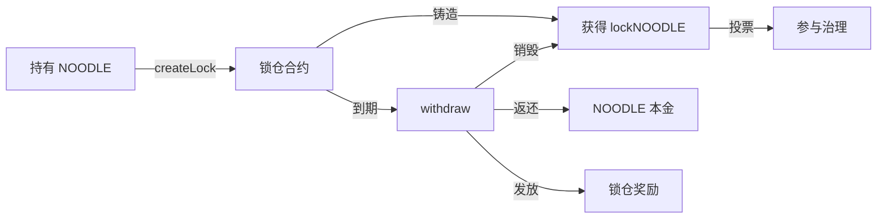
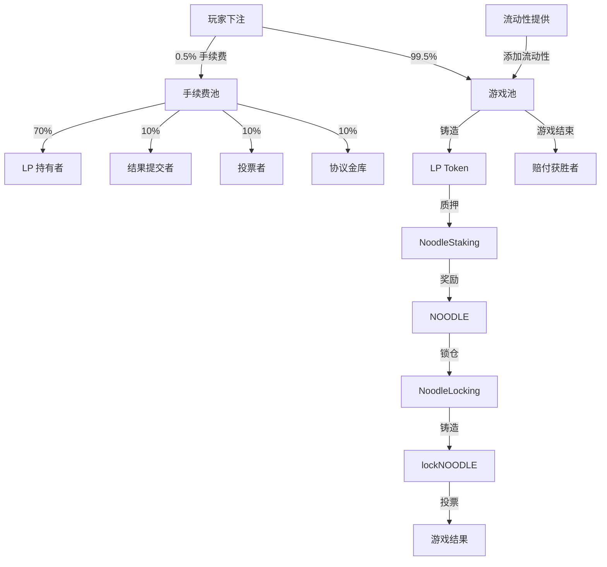
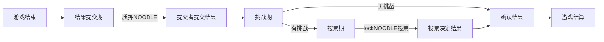

# NoodleSwap 代币经济学 🍜

> **版本**: 1.0.0  
> **最后更新**: 2026-01-14

---

## 📋 目录

- [概述](#概述)
- [代币系统](#代币系统)
- [核心经济机制](#核心经济机制)
  - [1. 赔率计算机制](#1-赔率计算机制)
  - [2. 下注冻结金额机制](#2-下注冻结金额机制)
  - [3. LP 流动性质押奖励](#3-LP流动性质押奖励)
  - [4. NOODLE 锁仓奖励](#4-NOODLE锁仓奖励)
- [价值流转](#价值流转)
- [治理机制](#治理机制)
- [经济模型总结](#经济模型总结)

---

## 概述

NoodleSwap 是一个创新的去中心化预测市场平台，将 **AMM（自动做市商）** 机制与预测游戏相结合，通过多层次的代币经济模型激励各方参与者：

- 🎯 **玩家**：参与预测游戏，获得赔付
- 💧 **流动性提供者**：提供做市资金，赚取手续费和质押奖励
- 🔒 **治理参与者**：锁仓代币，获得投票权和长期奖励
- 📊 **结果提交者**：质押代币提交结果，获得奖励

---

## 代币系统

NoodleSwap 生态系统包含以下代币：

### 1. **NOODLE Token** 🍜

**类型**: ERC20 治理代币

**功能**:
- ✅ 质押以获取结果提交权
- ✅ 锁仓以获得 lockNOODLE
- ✅ 流动性挖矿奖励代币
- ✅ 平台治理

**合约**: [`NoodleTokenERC20.sol`](../contracts/NoodleTokenERC20.sol)

---

### 2. **lockNOODLE Token** 🔐

**类型**: ERC20 投票托管代币（类似 veCRV）

**功能**:
- ✅ 游戏结果投票权（1 lockNOODLE = 1 票）
- ✅ 社区治理投票权
- ✅ 锁仓时 1:1 铸造，解锁时销毁
- ❌ 不可转让（绑定锁仓账户）

**合约**: [`LockNoodleTokenERC20.sol`](../contracts/LockNoodleTokenERC20.sol)

---

### 3. **LP Token** 💎

**类型**: ERC20 流动性凭证（每个游戏独立）

**功能**:
- ✅ 代表游戏池中的流动性份额
- ✅ 可质押到 NoodleStaking 获得 NOODLE 奖励
- ✅ 可交易、转让

**合约**: [`GameERC20.sol`](../contracts/GameERC20.sol)

---

### 4. **PlayNFT** 🎫

**类型**: ERC721 参与凭证

**功能**:
- ✅ 记录每笔下注的详细信息
- ✅ 用于领取获胜赔付
- ✅ 链上参与证明

**合约**: [`PlayNFT.sol`](../contracts/PlayNFT.sol)

**记录内容**:
```solidity
struct PlayInfoStruct {
    uint8 option;        // 下注的选项
    uint256 optionNum;   // 下注金额
    uint256 optionP;     // 下注时的赔率
    uint256 allFrozen;   // 冻结的对冲金额
}
```

---

## 核心经济机制

### 1. 赔率计算机制

#### 📊 原理

基于 **AMM 恒定乘积模型**的动态赔率系统，类似于 Uniswap 的 x*y=k 公式，但应用于预测市场。

#### 🧮 计算公式

对于选项 A 的赔率：

```
赔率_A = (选项B有效资金池) / (选项A有效资金池)

有效资金池 = 做市资金 + 下注金额 - 冻结金额
```

**代码实现**: [`LGame.sol#L23-L32`](../contracts/libraries/LGame.sol#L23-L32)

```solidity
function _calcOdd(OptionDataStruct memory a, OptionDataStruct memory b)
    public pure returns (uint256 p)
{
    uint256 sumA = a.placeNumber + a.marketNumber - a.frozenNumber;
    uint256 sumB = (b.placeNumber + b.marketNumber - b.frozenNumber) * 1 ether;
    p = sumB / sumA;
}
```

#### 📈 案例：足球比赛预测

**初始状态**:
| 选项 | 池资金 | 下注 | 冻结 | 有效池 | 赔率 |
|------|--------|------|------|--------|------|
| 队伍A | 1000 | 0 | 0 | 1000 | 1.0 |
| 队伍B | 1000 | 0 | 0 | 1000 | 1.0 |

**Alice 下注 200 tokens 到队伍A**:
| 选项 | 池资金 | 下注 | 冻结 | 有效池 | 赔率 |
|------|--------|------|------|--------|------|
| 队伍A | 1000 | 199 | 0 | 1199 | **0.668** ⬇️ |
| 队伍B | 1000 | 0 | 199 | 801 | **1.497** ⬆️ |

**Bob 下注 300 tokens 到队伍B**:
| 选项 | 池资金 | 下注 | 冻结 | 有效池 | 赔率 |
|------|--------|------|------|--------|------|
| 队伍A | 1000 | 199 | 298.5 | 900.5 | **1.221** ⬆️ |
| 队伍B | 1000 | 298.5 | 199 | 1099.5 | **0.819** ⬇️ |

> [!TIP]
> **市场规律**：下注越多的选项，赔率越低；冷门选项赔率越高。

---

### 2. 下注冻结金额机制

#### ❄️ 原理

当用户对某选项下注时，系统从**其他选项的资金池**中冻结相应金额，确保有足够资金支付潜在赔付。

#### 🧮 计算公式

```
冻结金额_j = 下注金额 × (选项j有效池 / 选项i有效池)
总冻结金额 = Σ 冻结金额_j (对所有 j ≠ i)
```

**代码实现**: [`LGame.sol#L208-L216`](../contracts/libraries/LGame.sol#L208-L216)

#### 📈 案例：三选一市场

**初始状态**:
| 选项 | 池资金 | 下注 | 冻结 | 有效池 |
|------|--------|------|------|--------|
| A | 1000 | 0 | 0 | 1000 |
| B | 1000 | 0 | 0 | 1000 |
| C | 1000 | 0 | 0 | 1000 |

**Charlie 下注 500 tokens 到选项A**:

计算冻结：
- 选项B 冻结: `497.5 × (1000/1000) = 497.5`
- 选项C 冻结: `497.5 × (1000/1000) = 497.5`
- 总冻结: `995 tokens`

**更新后**:
| 选项 | 池资金 | 下注 | 冻结 | 有效池 |
|------|--------|------|------|--------|
| A | 1000 | 497.5 | 0 | 1497.5 |
| B | 1000 | 0 | 497.5 | 502.5 |
| C | 1000 | 0 | 497.5 | 502.5 |

**Charlie 的 NFT 记录**:
- 下注金额: 497.5
- 冻结金额: 995
- **赔率**: (497.5 + 995) / 497.5 = **3.0x**

> [!IMPORTANT]
> 如果选项A获胜，Charlie 领取: `497.5 + 995 = 1492.5 tokens`（3倍收益）

---

### 3. LP 流动性质押奖励

#### 💎 原理

流动性提供者可以将 LP Token 质押到 **NoodleStaking** 合约，赚取 NOODLE 代币奖励。采用**时间加权份额累积模型**（类似 SushiSwap MasterChef）。

#### 🧮 核心公式

```
新增奖励 = (当前区块 - 上次奖励区块) × 每区块奖励
每份额累积奖励 += (新增奖励 × 1e12) / 总质押量
待领取奖励 = (用户质押量 × 每份额累积奖励 / 1e12) - 用户奖励债务
```

**代码实现**: [`NoodleStaking.sol`](../contracts/NoodleStaking.sol)

#### 📈 案例：LP 质押挖矿

**配置**:
- 每区块奖励: 100 NOODLE
- 区块时间: 2秒

**时间线**:

| 区块 | 事件 | Alice质押 | Bob质押 | 总质押 | 累积奖励/份额 | Alice待领取 | Bob待领取 |
|------|------|----------|---------|--------|---------------|-------------|-----------|
| 1000 | Alice质押1000 | 1000 | 0 | 1000 | 0 | 0 | - |
| 1100 | 经过100区块 | 1000 | 0 | 1000 | 10×10¹² | **10,000** | - |
| 1100 | Bob质押500 | 1000 | 500 | 1500 | 10×10¹² | 10,000 | 0 |
| 1200 | 经过100区块 | 1000 | 500 | 1500 | 16.667×10¹² | **16,667** | **3,333** |

**验证**:
```
总产出 = 200区块 × 100 NOODLE = 20,000 NOODLE
Alice + Bob = 16,667 + 3,333 = 20,000 ✓
```

> [!TIP]
> **特点**：
> - ✅ 随时存取，无锁定期
> - ✅ 实时累积奖励
> - ✅ 按份额公平分配

---

### 4. NOODLE 锁仓奖励

#### 🔒 原理

用户锁定 NOODLE 代币到 **NoodleLocking** 合约，获得：
1. **lockNOODLE** 代币（1:1铸造，用于投票）
2. **锁仓奖励**（到期时一次性发放）

#### 🧮 核心公式

```
锁仓区块数 = (解锁时间 - 锁仓时间) / 区块速度
锁仓占比 = 用户锁仓量 / 总锁仓量
奖励 = 每区块奖励 × 锁仓区块数 × 锁仓占比
```

**代码实现**: [`NoodleLocking.sol#L264-L277`](../contracts/NoodleLocking.sol#L264-L277)

#### 📈 案例：锁仓对比

**配置**:
- 每区块奖励: 50 NOODLE
- 区块速度: 2秒/块
- 总锁仓量: 100,000 NOODLE

**Alice 锁仓1年**:
```
锁仓: 10,000 NOODLE
时长: 365天 = 15,768,000区块
占比: 10,000/100,000 = 10%
奖励: 50 × 15,768,000 × 0.1 = 78,840,000 NOODLE
ROI: 788.4% 🔥
```

**Bob 锁仓6个月**:
```
锁仓: 5,000 NOODLE
时长: 180天 = 7,776,000区块
占比: 5,000/105,000 = 4.76%
奖励: 50 × 7,776,000 × 0.0476 = 18,504,960 NOODLE
ROI: 370.1%
```

**对比分析**:

| 用户 | 锁仓量 | 时长 | 奖励 | ROI |
|------|--------|------|------|-----|
| Alice | 10,000 | 365天 | 78,840,000 | **788.4%** 🔥 |
| Bob | 5,000 | 180天 | 18,504,960 | 370.1% |

> [!IMPORTANT]
> **关键洞察**：
> - Alice 锁仓时长是 Bob 的 2 倍
> - 但奖励是 Bob 的 **4.26 倍**
> - **锁仓时长对奖励影响巨大**（线性增长）

#### 🔄 锁仓流程



---

## 价值流转

### 💰 手续费分配

每笔下注收取 **0.5%** 手续费，分配如下：

| 接收方 | 占比 | 用途 |
|--------|------|------|
| 流动性提供者 | 70% | LP Token 持有者分红 |
| 结果提交者 | 10% | 激励正确提交结果 |
| 投票者 | 10% | 奖励投票参与者 |
| 协议金库 | 10% | 平台发展基金 |

**代码**: [`Game.sol#L93`](../contracts/Game.sol#L93)

---

### 🔄 代币流动图



---

## 治理机制

### 🗳️ 游戏结果治理

#### 三阶段治理流程



#### 参与角色

| 角色 | 质押物 | 奖励 | 惩罚 |
|------|--------|------|------|
| **结果提交者** | NOODLE | 质押金 + 手续费10% | 如被挑战成功，损失质押金 |
| **挑战者** | NOODLE | 质押金 + 额外奖励 | 如挑战失败，损失质押金 |
| **投票者** | lockNOODLE | 投给正确结果者瓜分奖励 | 无（投票后返还lockNOODLE） |

**代码实现**:
- 提交结果: [`Game.sol#L254-L272`](../contracts/Game.sol#L254-L272)
- 挑战: [`Game.sol#L274-L291`](../contracts/Game.sol#L274-L291)
- 投票: [`Game.sol#L304-L375`](../contracts/Game.sol#L304-L375)

---

## 经济模型总结

### 📊 四大机制对比

| 机制 | 目的 | 参与者 | 奖励方式 | 灵活性 | 风险 |
|------|------|--------|----------|--------|------|
| **赔率计算** | 市场定价 | 玩家 | 预测正确获赔付 | 高 | 中 |
| **冻结金额** | 确保偿付能力 | 系统自动 | 获胜即赔付 | 锁定至结算 | 高 |
| **LP质押** | 激励流动性 | LP提供者 | 实时区块奖励 | 随时存取 | 低 |
| **NOODLE锁仓** | 治理+长期激励 | 治理参与者 | 到期一次性结算 | 锁定期内不可取 | 中 |

---

### 🎯 生态角色定位

#### 1. **短期玩家** 🎲
- **参与方式**: 下注预测游戏
- **收益来源**: 预测正确的赔付
- **风险**: 预测错误损失本金
- **特点**: 高风险高回报，需要信息优势

#### 2. **流动性提供者** 💧
- **参与方式**: 添加流动性 → 获得LP Token → 质押获得奖励
- **收益来源**: 
  - ✅ 70% 手续费分红
  - ✅ NOODLE 质押奖励
- **风险**: 无常损失（市场不平衡时）
- **特点**: 稳定收益，适合长期持有

#### 3. **治理参与者** 🗳️
- **参与方式**: 锁仓NOODLE → 获得lockNOODLE → 投票
- **收益来源**:
  - ✅ 锁仓奖励（与时长成正比）
  - ✅ 投票奖励（10%手续费分配）
  - ✅ 治理权重
- **风险**: 锁定期内流动性牺牲
- **特点**: 长期激励，适合坚定持有者

#### 4. **结果提交者** 📊
- **参与方式**: 质押NOODLE提交游戏结果
- **收益来源**:
  - ✅ 质押金返还
  - ✅ 10% 手续费奖励
  - ✅ 额外奖励（如击败挑战者）
- **风险**: 提交错误结果损失质押金
- **特点**: 需要准确信息，激励诚实行为

---

### 💡 经济模型优势

✅ **多层激励**: 不同角色都有明确的收益路径  
✅ **自平衡机制**: AMM自动调节市场赔率  
✅ **去中心化治理**: lockNOODLE投票决定结果  
✅ **长期价值锁定**: 锁仓机制减少代币抛压  
✅ **可持续发展**: 手续费支撑生态运转  

---

### ⚠️ 风险提示

> [!WARNING]
> **重要提醒**：
> - 🔴 预测市场存在本金损失风险
> - 🔴 锁仓期间NOODLE无法提取
> - 🔴 治理投票需谨慎，错误投票可能影响收益

---

## 📚 参考资料

### 核心合约
- [Game.sol](../contracts/Game.sol) - 游戏主合约
- [LGame.sol](../contracts/libraries/LGame.sol) - 游戏逻辑库
- [NoodleStaking.sol](../contracts/NoodleStaking.sol) - LP质押合约
- [NoodleLocking.sol](../contracts/NoodleLocking.sol) - 锁仓合约
- [GameFactory.sol](../contracts/GameFactory.sol) - 游戏工厂

### 文档
- [README.zh-CN.md](../README.zh-CN.md) - 项目概述
- [ARCHITECTURE.md](../ARCHITECTURE.md) - 架构设计

---

**最后更新**: 2026-01-14  
**维护者**: NoodleSwap 开发团队  
**许可证**: MIT

---

<div align="center">

**由 NoodleDAO 团队用 ❤️ 打造**

[GitHub](https://github.com/NoodleDAO/noodleswap) | [文档](../docs) | [Discord](#) | [Twitter](#)

</div>
